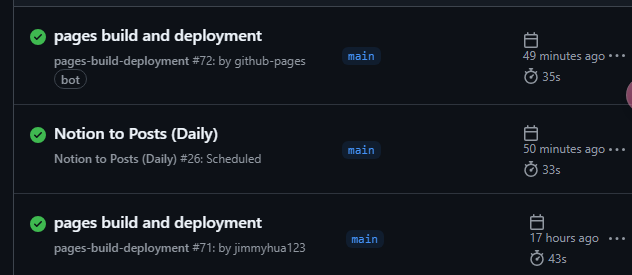
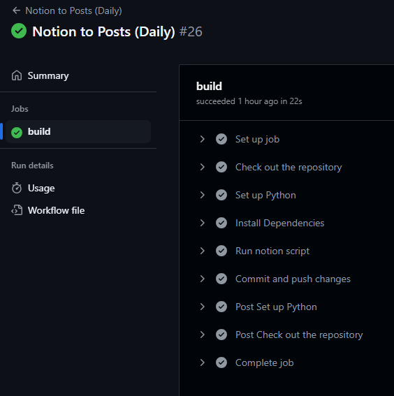
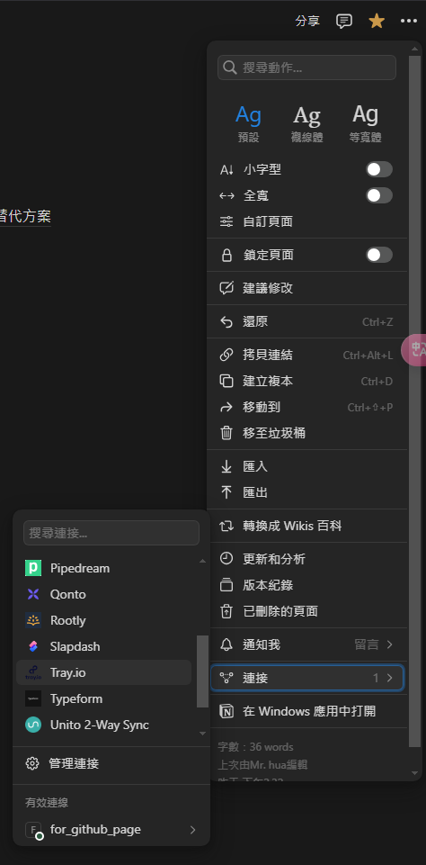

# Jimmy Hua's Notion Export

這個專案使用 GitHub Actions 自動同步 Notion 筆記，轉換為 Markdown，並發布到 GitHub Pages。

## 專案概述

- **主題**: [Not Pure Poole](https://github.com/vszhub/not-pure-poole)
- **網站地址**: [Jimmy Hua's Notion Export](https://jimmyhua123.github.io/jimmyhua_notion.github.io)
- **自動同步**: Github Actions 每日從 Notion 獲取內容，轉換為 Markdown，並發布至 `_posts/`

## 目錄結構

```sh
jimmyhua_notion.github.io/
├── _config.yml              # Jekyll 設定檔
├── _posts/                  # 存放 Notion 匯出的 Markdown 文章 (每日自動同步)
│   ├── 2024-01-01-example.md
│   └── ...
├── .github/
│   └── workflows/
│       └── notion_daily.yml # GitHub Actions 自動同步腳本
├── avatar.jpeg      # 頭像
├── bg.jpeg          # 背景圖
├── index.html               # 首頁
├── notion_to_markdown.py    # Notion 轉 Markdown 腳本
└── README.md                # 本文件
```


## 設定與使用

### 1. 建立 GitHub Repository 並複製專案

首先，在 GitHub 上建立一個新的 Repository，然後將本專案的所有檔案上傳至該 Repository，或透過 Git 方式複製：

```sh
git clone https://github.com/jimmyhua123/jimmyhua_notion.github.io.git
cd jimmyhua_notion.github.io
```
接著更改 
- 刪除_posts中所有md檔
- _data/social.yml 中的社交媒體連結
- _config_.yml 中的 url、名稱、email等等
- avatar.jpeg(頭像)、bg.jpg(背景)的圖片，如需要改路徑名稱在_config_.yml
- notion_to_markdown.py 中的 ROOT_PAGE_ID ，這是你的notion頁面id 
=> https://www.notion.so/頁面名稱-[ROOT_PAGE_ID]

再將專案推送到你的 GitHub Repository：

```sh
git remote add origin https://github.com/你的帳號/你的倉庫.git
git branch -M main
git push -u origin main
```
### 2. 建立 Notion API Token 

1. 前往 [Notion Integrations](https://www.notion.so/profile/integrations) 建立新的 Integration：
   - **名稱**: 可自行設定
   - **類型**: Internal
2. 在 Notion 筆記頁面，點擊右上角 **三點選單** → **連接 Integration**。

### 3. 設定 GitHub Repository Secrets

1. 前往 GitHub Repository，進入 **Settings** → **Secrets and variables** → **Actions**。
2. 點擊 **New repository secret**，新增以下 Secrets：
   - **`NOTION_TOKEN`**: 你的 Notion API Token（可在 Notion Integrations 內取得）。


### 4. 佈署到 GitHub Pages

Jekyll 會自動將 `_posts/` 中的 Markdown 轉為靜態網站。

1. **開啟 GitHub Pages**
   - 前往 GitHub Repository → **Settings** → **Pages**。
   - 設定 **Branch** 為 `main`，並選擇 `/(root)` 目錄。
   - 儲存後，GitHub 會自動生成網站。

2. **手動更新 GitHub Pages**
   - 進入 GitHub → **Actions**
   - 選擇 **Notion to Posts (Daily)**，點擊 **Run workflow**。




## 常見問題（FAQ）

### 1. GitHub Actions 沒有自動同步？
可能原因：
- **未設定 GitHub Secrets**：請確認 `NOTION_TOKEN` 是否已在 **Settings → Secrets and variables → Actions** 中設定。
- **GitHub Actions 被停用**：前往 **GitHub → Actions**，確認 **Notion to Posts (Daily)** 工作流是否啟用，或進入查看錯誤部分


### 2. GitHub Pages 網站沒有更新？
可能原因：
- **GitHub Pages 設定錯誤**：前往 **Settings → Pages**，確認 **Branch** 設為 `main`，目錄為 `/(root)`。
- **未手動觸發部署**：嘗試進入 **GitHub → Actions**，手動執行 **Notion to Posts (Daily)** 工作流。

### 3. Notion API 權限錯誤？
可能原因：
- **Notion Integration 沒有連結到筆記頁面**：請打開 Notion，確保筆記頁面已連結至剛建立的 Integration。
- **`ROOT_PAGE_ID` 設置錯誤**：請確認 `notion_to_markdown.py` 中的 `ROOT_PAGE_ID` 是否正確。

### 4. Notion 內容轉換後格式錯誤？
可能原因：
- **Markdown 解析問題**：部分 Notion 樣式（如表格、嵌入頁面）可能無法正確轉換，建議手動調整 `_posts/` 內的 Markdown 內容，或是自行修改 `notion_to_markdown.py` 中的funtion。

---

📌 **如果問題仍然無法解決，可以提交 GitHub Issue 或聯絡作者！**

## 授權

本專案採用 [MIT License](https://opensource.org/licenses/MIT)。

---

💡 **專案作者**: Jimmy Hua  
📧 **Email**: [jimmy0624062461@gmail.com](mailto:jimmy0624062461@gmail.com)


